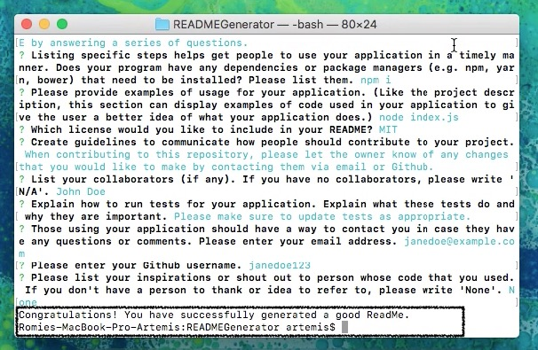

# README Generator

## Table of Contents
*  [Description](#description)
*  [User Story](#user-story)
*  [Features of the Application](#features-of-the-application)
*  [Preview of README Generator](#preview-of-README-generator)
*  [Links](#links)
*  [Installation](#installation)
*  [Usage](#usage)
*  [License](#license)
*  [Contributing](#contributing)
*  [Questions](#questions)

## Description

Generating a purposeful README is important to every project. A purposeful README is thorough and has a descriptive title (that is self-explaining); a short description explaining the what, why, and how of your application; specific steps that help get the users to flow through your application without any issues; examples of code used in your application to give the user a better idea of what your application does; license information, and a way for users to contact you in case they have any questions or comments. 

The README Generator is a command line interface application that allows the user to create a new README by answering a series of questions about their repository. Once the user has answered all of the questions about their repository, a README file is generated for the user (with the answers that the user inputted into the command line).

## User Story
~~~
AS A user   
I WANT to create a thorough, high-quality, professional README documentation  
SO THAT I can provide a description and demonstration of my application to my users.
~~~

## Features of the Application
~~~
GIVEN a command-line application that accepts user input  
WHEN I am prompted for information about my application repository  
THEN a README file is generated with the title of your project and sections entitled Description, Table of Contents, Installation, Usage, License, Contributing, Tests, and Questions.
~~~

## Preview of README Generator

The following animation demonstrates the application functionality:

  

The following images (with notes) demonstrate the application functionality and provide explanations for specific lines of code in the command line.:

  

  

The following image demonstrates a message from the console log that congratulates the user for successfully completing the application as it runs the function to write a new README file.:

  

## Links

* [Github Repository](https://github.com/rh9891/READMEGenerator)

## Installation

The application requires the following dependencies and/or package managers:
~~~
npm install inquirer
~~~

## Usage

An example of usage of the function writing the user inputs into a README file:
~~~
(function(generatedREADMEInput) {
    fs.writeFile("goodREADME.md", generatedMarkdown(generatedREADMEInput), function(err) {
        if (err) throw err;
        console.log("Congratulations! You have successfully generated a good ReadMe.");
        })
~~~

## License

This application does not currently have any licenses, so the user is not permitted to use, modify, or share any parts of it. Though the code for this application is hosted on Github, where you are allowed to view and fork the code, this does not imply that the user is permitted to use, modify, or share the contents of this application for any purpose.

## Contributing

If you would like to contribute to this repository, please contact me via [Github](https://github.com/rh9891).

## Questions

If you have any questions, comments, or issues regarding this command line interface application, please don't hesitate to contact me via [Github](https://github.com/rh9891).